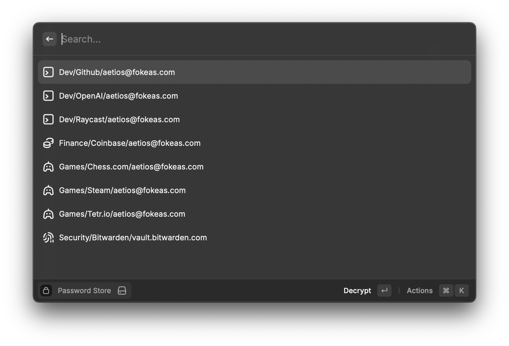
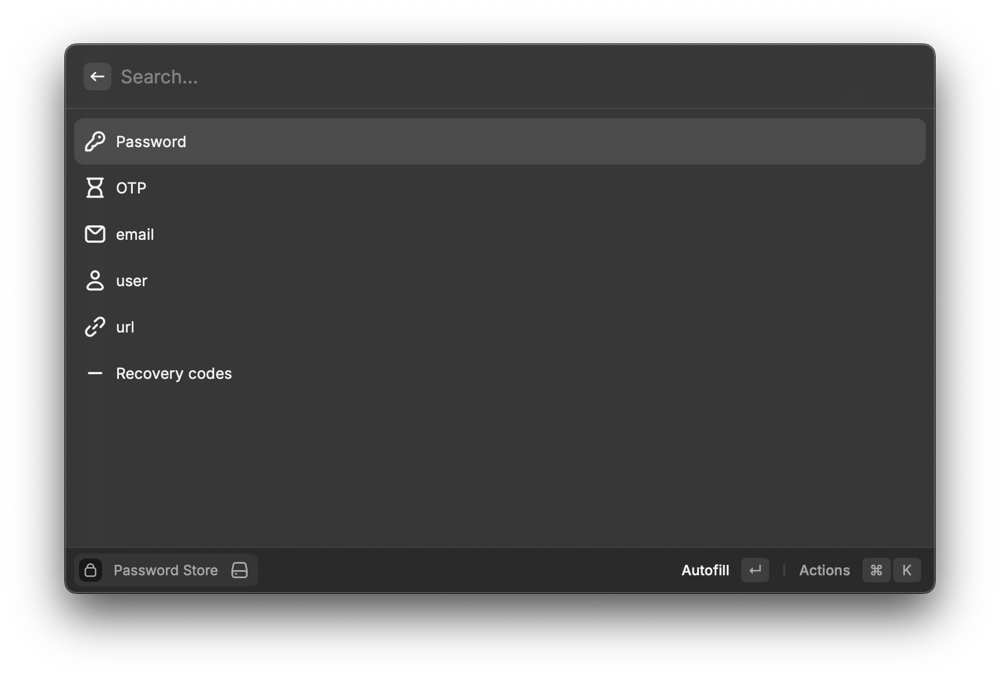
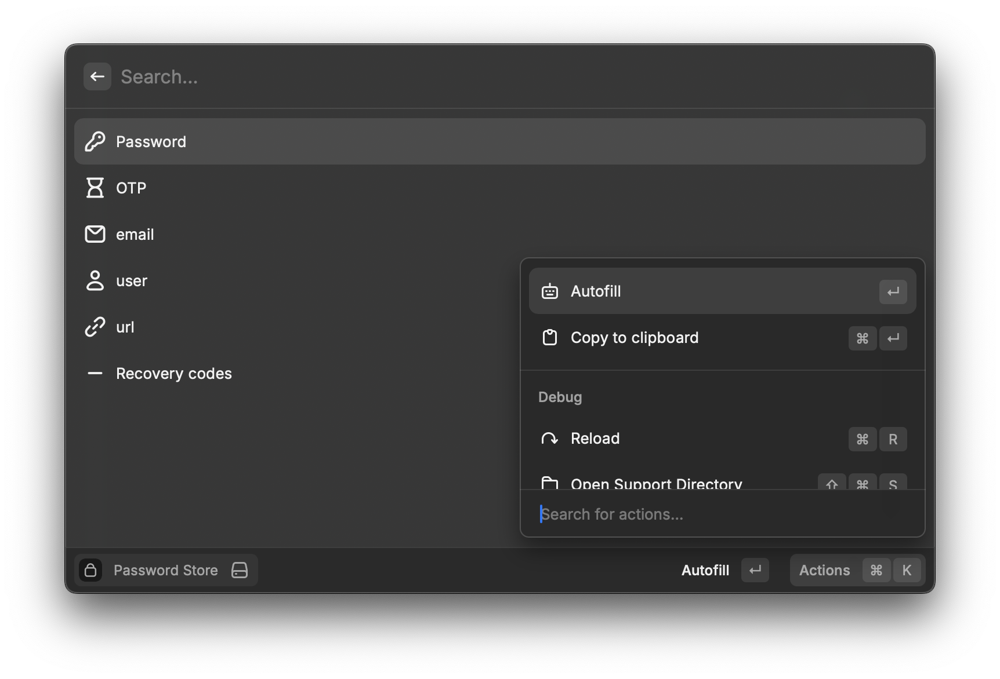

# Password Store

Raycast Extension for copying/pasting credentials from your password store (aka [pass](https://passwordstore.org))

### List all the available passwords
By default, this extension looks in the `~/.password-store` directory for any files ending in `.gpg` and lists them.

### See the contents of a password
* First line of evey file contains the password
* If a file contains an OTP URI (line starting with `otpauth://`) a new OTP entry will be added to the options.
* For the remaining lines, if they follow the `Key: Value` format, a new entry will be added to the options using the `Key` as a title, and the `Value` as the value.

### Select an action
The default behaviour when you select an option is to 'paste' the value. The secondary option (Ctrl+Enter) is to copy the value to your clipboard.

